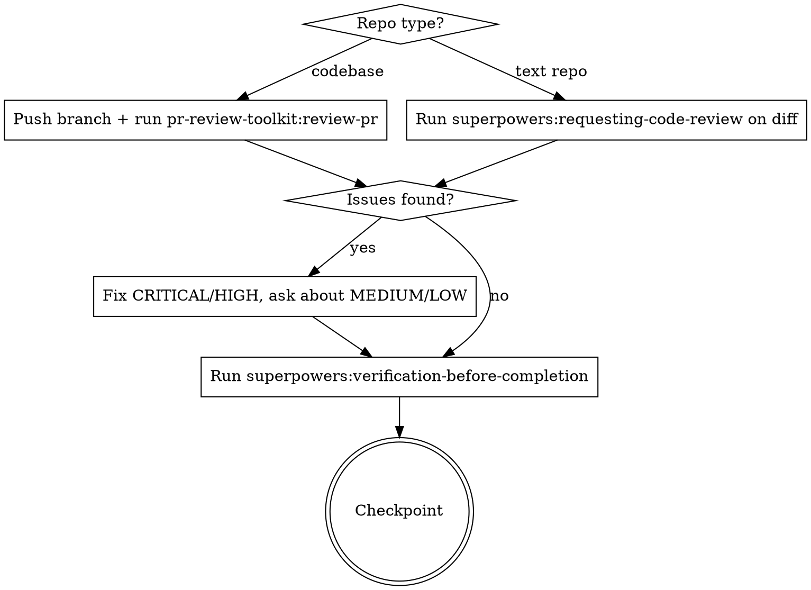
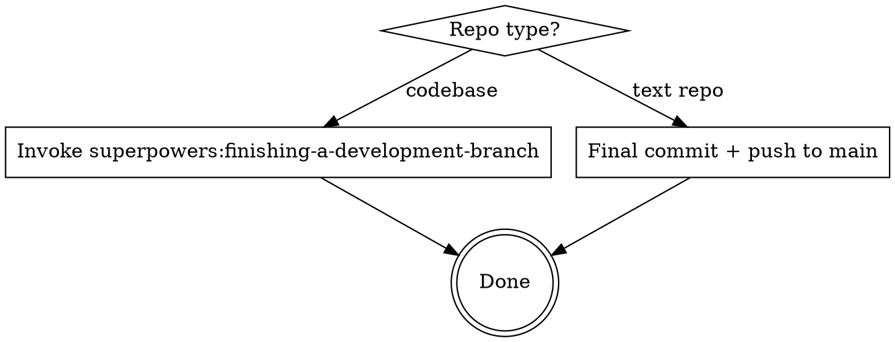

# Orchestrate — Phase Details

## Phase 0: Explore

Update state file: `phase: explore`, Explore status -> `in-progress`.

Invoke the `superpowers:brainstorming` skill to explore the idea with the user.

- Clarify requirements and constraints
- Propose 2-3 approaches with trade-offs
- **If requirements are ambiguous or there are 3+ valid approaches:** Use `mcp__sequential-thinking__sequentialthinking` to reason through trade-offs systematically before proposing

Update state file: Explore status -> `done`.

**Manual mode:** Ask user: "Does this capture what you want to build? Approve to continue to planning?"

**Ralph mode:** Continue automatically. Pick the strongest approach based on brainstorming analysis.

---

## Phase 1: Plan

Update state file: `phase: plan`, Plan status -> `in-progress`.

Invoke the `superpowers:writing-plans` skill to create an implementation plan.

- Read project standards for tech stack and coding conventions
- Create a detailed plan at `docs/plans/YYYY-MM-DD-[feature]-plan.md`
- Break into bite-sized tasks with exact file paths, code, and test commands
- **If task dependencies are complex or ordering is non-obvious:** Use `mcp__sequential-thinking__sequentialthinking` to work through dependency chains and sequencing

Update state file: `plan_path` -> the plan file path, Plan status -> `done`.

**Manual mode:** Ask user: "Review the plan. Approve to start building?"

**Ralph mode:** Continue automatically.

---

## Phase 1.5: Branch Setup (codebases only)

**Skip this phase entirely for text repos.**

Update state file: `phase: branch`, Branch status -> `in-progress`.

After plan approval, before any code changes:

1. Invoke `superpowers:using-git-worktrees` to create an isolated feature branch
2. Branch name: `feat/[feature-slug]` (derived from the plan title)
3. Confirm worktree is ready before proceeding to build

Update state file: `branch` -> the branch name, Branch status -> `done`.

This ensures all implementation happens on a feature branch, not main.

---

## Phase 2: Build

Update state file: `phase: build`, Build status -> `in-progress`.

**Always use `superpowers:subagent-driven-development`.** Do not ask which execution mode to use — subagent-driven is the default. Only fall back to `superpowers:executing-plans` if subagents are unavailable on the platform or its a small enough change that one context window is more beneficial.

- Implement task-by-task following the plan
- **Codebases:** Write tests before implementation (TDD), commit after each completed task
- **Text repos:** Commit logical chunks as you go
- Follow project standards throughout

**Context pressure check:** If the conversation is deep into context (many tool calls, large diffs), update the state file and let the context reset. The next iteration will resume from the build phase using the plan file.

Update state file: Build status -> `done`.

**Manual mode:** Ask user: "Implementation complete. Ready for review?"

**Ralph mode:** Continue automatically.

---

## Phase 3: Review

Update state file: `phase: review`, Review status -> `in-progress`.



**Codebases:**
1. Push the feature branch to remote
2. Invoke `pr-review-toolkit:review-pr` — fires six specialized reviewers (silent failure hunter, type design analyzer, PR test analyzer, code reviewer, code simplifier, comment analyzer)
3. **Security gate (scope-based):** If `git diff main...HEAD` touches any of the sensitive paths below, invoke the `security-review` agent on the diff.
   - `**/api/**`, `**/routes/**`, `**/auth/**`, `**/middleware/**`
   - `supabase/migrations/**`, `**/rls/**`, anything referencing `auth.uid()` or `service_role`
   - `.mcp.json`, `**/skills/**/SKILL.md`, `.claude/agents/**`
   - Any file matching `.env*`, or diff lines adding `NEXT_PUBLIC_`, `VITE_`, `REACT_APP_` env vars
   - LLM feature code (prompt construction, tool-use wiring, model API calls)

   Ralph mode: fix every Blocker the agent reports before continuing. Manual mode: surface findings to the user.

   If the `security-review` agent is not installed (not present in `~/.claude/agents/` or the repo's `.claude/agents/`), warn the user and skip — do not silently proceed as if no issues exist.
4. Fix critical/high issues from either reviewer, ask user about medium/low
5. Run `superpowers:verification-before-completion` to verify all tests pass
- **If review findings conflict or severity is unclear:** Use `mcp__sequential-thinking__sequentialthinking` to reason through triage decisions

**Text repos:**
1. Invoke `superpowers:requesting-code-review` on the diff since orchestration started
2. **Security gate (supply-chain):** If the diff touches `.mcp.json`, `**/skills/**/SKILL.md`, or `.claude/agents/**`, invoke the `security-review` agent with an explicit lethal-trifecta check (private-data access + untrusted-content exposure + external communication). These files are code-shaped even in text repos.
3. Fix any issues found
4. Run `superpowers:verification-before-completion`

Update state file: Review status -> `done`.

**Manual mode:** Ask user: "Review complete. Approve to write documentation?"

**Ralph mode:** Continue automatically. Fix all critical/high issues. Skip medium/low unless the fix is trivial.

---

## Phase 4: Document

Update state file: `phase: document`, Document status -> `in-progress`.

Use the Technical Writer agent (`technical-writer`) to create or update documentation:

- Update README.md with feature documentation
- Add usage examples and code samples
- Document API endpoints if applicable
- Add troubleshooting for common issues

**After docs are written, commit them** (to feature branch for codebases, to main for text repos).

Then run `/wrap` to capture session learnings and produce a summary.

Update state file: Document status -> `done`.

**Manual mode:** Ask user: "Documentation complete. Ready to ship?"

**Ralph mode:** Continue automatically.

---

## Ship

Update state file: `phase: ship`, Ship status -> `in-progress`.



**Codebases:** Invoke `superpowers:finishing-a-development-branch` which presents options:
- **Manual mode:** Present all options (create PR, merge locally, keep branch, discard)
- **Ralph mode:** Default to creating a PR automatically

**CI gate (codebases with a PR):** After the PR is created/updated, wait for CI before declaring completion.

1. Poll `gh pr checks --watch` (or `gh pr checks` in a loop) until every required check has a conclusion.
2. If all checks pass → proceed to "done".
3. If any check fails:
   - Fetch the failing logs (`gh run view <run-id> --log-failed`).
   - **Ralph mode:** attempt one auto-fix cycle — diagnose, edit, push, re-poll. If the second run also fails, stop and report.
   - **Manual mode:** surface the failure to the user and wait for direction.
4. Do not emit `ORCHESTRATE_COMPLETE` while checks are pending or red.

If the repo has no CI configured, skip this gate but note it in the state file (`ci_gate: none`).

**Text repos:** Ensure all changes are committed and push to main.

Update state file: Ship status -> `done`.

**Ralph mode:** Output the completion promise and delete the state file:

```
<promise>ORCHESTRATE_COMPLETE</promise>
```
