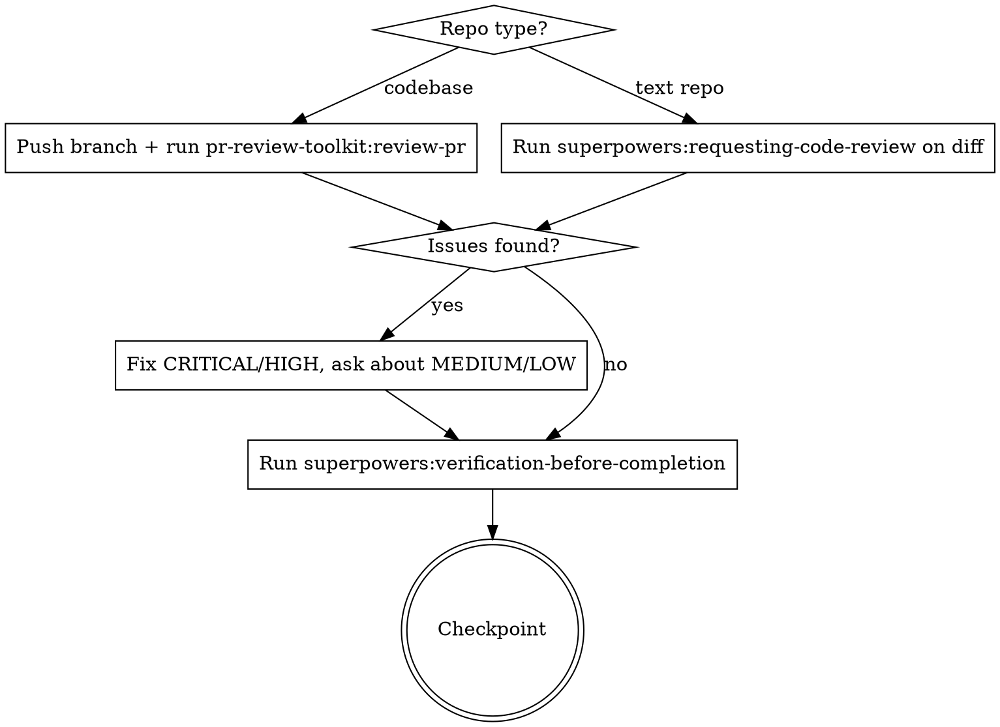
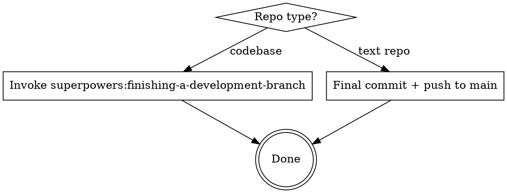

# Orchestrate — Phase Details

## Sensitive-Scope Criteria (shared)

Several phases reference "sensitive scope" — a single set of signals defined here so every phase agrees on what counts.

A feature / diff is **sensitive-scope** if any of the following apply:

**Feature-description signals (detectable in Phase 0 from brainstorming output):**
- Mentions auth, authentication, authorization, roles, permissions, tokens, sessions, SSO, OAuth
- Touches RLS, Supabase policies, or row-level access
- Adds or modifies a public API surface or external webhook
- Modifies `.mcp.json`, skills, or agent definitions (supply-chain surface — see ClawHavoc)
- Handles payments, billing, PHI, PII, or legal-compliance data
- Introduces an LLM feature with tool use, external content ingestion, or network egress (the lethal trifecta)

**Diff-path signals (detectable in Phase 3 from `git diff main...HEAD`):**
- `**/api/**`, `**/routes/**`, `**/auth/**`, `**/middleware/**`
- `supabase/migrations/**`, `**/rls/**`, anything referencing `auth.uid()` or `service_role`
- `.mcp.json`, `**/skills/**/SKILL.md`, `.claude/agents/**`
- Any file matching `.env*`, or diff lines adding `NEXT_PUBLIC_`, `VITE_`, `REACT_APP_` env vars
- LLM feature code (prompt construction, tool-use wiring, model API calls)

Store the result in the state file as `sensitive_scope: true | false` after Phase 0. Phases 2, 3, and Ship all read it.

**User override:** if the user invokes `/orchestrate --trust-ralph-on-sensitive ...`, set `sensitive_scope: overridden` instead of `true`. Downstream phases treat `overridden` like `false`, but the PR trailer records it explicitly so reviewers can see.

---

## Phase 0: Explore

Update state file: `phase: explore`, Explore status -> `in-progress`.

Invoke the `superpowers:brainstorming` skill to explore the idea with the user.

- Clarify requirements and constraints
- Propose 2-3 approaches with trade-offs
- **If requirements are ambiguous or there are 3+ valid approaches:** Use `mcp__sequential-thinking__sequentialthinking` to reason through trade-offs systematically before proposing

**Sensitive-scope detection.** Before closing Phase 0, apply the feature-description signals from the Sensitive-Scope Criteria block to the brainstorming output. If any signal matches, set `sensitive_scope: true` in the state file. Surface the detection to the user at the Phase 0 checkpoint:

> "Detected sensitive scope ({matching signals}). Ralph will still run, but Plan, Build, and Review will pause for manual approval."

If the user invoked `/orchestrate --trust-ralph-on-sensitive`, set `sensitive_scope: overridden` and note in the state file.

Update state file: Explore status -> `done`.

**Manual mode:** Ask user: "Does this capture what you want to build? Approve to continue to planning?"

**Ralph mode:** Continue automatically. Pick the strongest approach based on brainstorming analysis.

**Ralph mode with `sensitive_scope: true`:** Elevate to manual checkpoints for Plan, Build, and Review. Ralph still does the work inside each phase — it just pauses at the gates for human sign-off. Ship (CI gate) behaviour is unchanged.

---

## Phase 1: Plan

Update state file: `phase: plan`, Plan status -> `in-progress`.

Invoke the `superpowers:writing-plans` skill to create an implementation plan.

- Read project standards for tech stack and coding conventions
- Create a detailed plan at `docs/plans/YYYY-MM-DD-[feature]-plan.md`
- Break into bite-sized tasks with exact file paths, code, and test commands
- **If task dependencies are complex or ordering is non-obvious:** Use `mcp__sequential-thinking__sequentialthinking` to work through dependency chains and sequencing

Update state file: `plan_path` -> the plan file path, Plan status -> `done`.

**Manual mode:** Ask user: "Review the plan. Approve to start building?"

**Ralph mode:** Continue automatically.

---

## Phase 1.5: Branch Setup (codebases only)

**Skip this phase entirely for text repos.**

Update state file: `phase: branch`, Branch status -> `in-progress`.

After plan approval, before any code changes:

1. Invoke `superpowers:using-git-worktrees` to create an isolated feature branch
2. Branch name: `feat/[feature-slug]` (derived from the plan title)
3. Confirm worktree is ready before proceeding to build
4. **Pre-push secrets scan (see shared section below).** No push in this phase yet, but ensure `gitleaks` is available so Phase 3 can push safely.

Update state file: `branch` -> the branch name, Branch status -> `done`.

This ensures all implementation happens on a feature branch, not main.

### Pre-push secrets scan (shared helper)

Any phase that pushes must first run a local gitleaks scan — CI catches secrets *after* they reach remote history, which is already too late.

Before every `git push` originating from /orchestrate:

```bash
gitleaks protect --staged --redact --verbose || gitleaks detect --source=. --redact --verbose
```

- **Clean:** proceed with push.
- **Finding:** stop immediately. Do not commit, do not push. Surface the redacted output.
  - Ralph mode: halt the run. Do not "fix" by rewriting history autonomously — secret rotation is a human decision.
  - Manual mode: surface to user and wait.
- **`gitleaks` not installed:** warn loudly ("pre-push secrets scan unavailable — install with `brew install gitleaks`") and require explicit user confirmation to proceed. Never silently skip. In Ralph mode, halt and record `secrets_scan: unavailable` in the state file.

This is a local first line of defence; CI-side scanning (Semgrep secrets rules, etc.) remains the second line.

---

## Phase 2: Build

Update state file: `phase: build`, Build status -> `in-progress`.

**Always use `superpowers:subagent-driven-development`.** Do not ask which execution mode to use — subagent-driven is the default. Only fall back to `superpowers:executing-plans` if subagents are unavailable on the platform or its a small enough change that one context window is more beneficial.

- Implement task-by-task following the plan
- **Codebases:** Write tests before implementation (TDD), commit after each completed task
- **Text repos:** Commit logical chunks as you go
- Follow project standards throughout

**Fail-loud instruction (include in every sub-agent prompt).** AI code's #1 failure mode is silent success — swallowing errors and returning mock/default values so the system looks like it's working. Paste this into the sub-agent prompt for every Build task:

> Fail loud. Do not swallow errors. Specifically:
> - No `try/except` (Python) or `try/catch` (JS/TS) that returns a shape-compatible empty / default / mock value on failure. Re-raise, or let it propagate.
> - No `?? defaultValue`, `|| fallback`, `.get(key, default)` for *required* config, credentials, or external-API responses. Fail fast with a clear message naming what's missing.
> - Network / API / database errors must surface — return them or raise them, don't log-and-continue.
> - If a genuine fallback is needed (e.g. optional feature flag, degraded-but-correct mode), make it explicit: a named `FALLBACK_*` constant, a comment stating the invariant, and a log line when it triggers.
> - Prefer crashing with a stack trace to returning fake data. A crash is a 5-minute fix; silent wrong-data is a Thursday afternoon gone.

**Context pressure check:** If the conversation is deep into context (many tool calls, large diffs), update the state file and let the context reset. The next iteration will resume from the build phase using the plan file.

Update state file: Build status -> `done`.

**Manual mode:** Ask user: "Implementation complete. Ready for review?"

**Ralph mode:** Continue automatically.

---

## Phase 3: Review

Update state file: `phase: review`, Review status -> `in-progress`.



**Codebases:**
1. **Pre-push secrets scan** (see Phase 1.5 — "Pre-push secrets scan" shared helper). Run before the push below.
2. Push the feature branch to remote
3. Invoke `pr-review-toolkit:review-pr` — fires six specialized reviewers (silent failure hunter, type design analyzer, PR test analyzer, code reviewer, code simplifier, comment analyzer)
4. **Security gate (scope-based):** If `sensitive_scope: true` in the state file, OR if `git diff main...HEAD` matches any diff-path signal in the Sensitive-Scope Criteria block, invoke the `security-review` agent on the diff.

   Ralph mode: fix every Blocker the agent reports before continuing. Manual mode: surface findings to the user.

   If the `security-review` agent is not installed (not present in `~/.claude/agents/` or the repo's `.claude/agents/`), warn the user and skip — do not silently proceed as if no issues exist.
5. Fix critical/high issues from either reviewer, ask user about medium/low
6. Run `superpowers:verification-before-completion` to verify all tests pass
7. **Runtime / exploit-path pass (conditional).** Static review is a hypothesis engine; the bugs that cause real incidents (arbitrary refund, wrong-role access) only surface when an end-to-end flow runs with identity switching. Trigger this pass when **any** of:
   - The static `security-review` pass in step 4 flagged auth or authorization issues
   - The diff touches `**/auth/**` or `**/api/**`
   - `sensitive_scope: true` in the state file

   Invoke `security-review` a second time with this explicit brief:

   > Trace one end-to-end exploit path through the running system for the feature in this diff. Exercise (a) unauthenticated access and (b) authenticated-but-wrong-role access to every new or modified endpoint. Use existing test fixtures, a running dev server, or Playwright if available — do not stand up new infrastructure. Report any request that returned data the actor shouldn't see, or mutated state the actor shouldn't mutate. A failure here is a Blocker.

   If no runtime environment is reachable (no dev server running, no fixtures), record `runtime_pass: skipped-no-env` in the state file and warn the user — do not silently pass. This pass is a cheap check, not a substitute for a human pentest on truly sensitive flows (payments, PHI, SSO bridging — see security-review agent's escalation list).
- **If review findings conflict or severity is unclear:** Use `mcp__sequential-thinking__sequentialthinking` to reason through triage decisions

**Text repos:**
1. Invoke `superpowers:requesting-code-review` on the diff since orchestration started
2. **Security gate (supply-chain):** If the diff touches `.mcp.json`, `**/skills/**/SKILL.md`, or `.claude/agents/**`, invoke the `security-review` agent with an explicit lethal-trifecta check (private-data access + untrusted-content exposure + external communication). These files are code-shaped even in text repos.
3. Fix any issues found
4. Run `superpowers:verification-before-completion`

Update state file: Review status -> `done`.

**Manual mode:** Ask user: "Review complete. Approve to write documentation?"

**Ralph mode:** Continue automatically. Fix all critical/high issues. Skip medium/low unless the fix is trivial.

---

## Phase 4: Document

Update state file: `phase: document`, Document status -> `in-progress`.

Use the Technical Writer agent (`technical-writer`) to create or update documentation:

- Update README.md with feature documentation
- Add usage examples and code samples
- Document API endpoints if applicable
- Add troubleshooting for common issues

**After docs are written, commit them** (to feature branch for codebases, to main for text repos).

Then run `/wrap` to capture session learnings and produce a summary.

Update state file: Document status -> `done`.

**Manual mode:** Ask user: "Documentation complete. Ready to ship?"

**Ralph mode:** Continue automatically.

---

## Ship

Update state file: `phase: ship`, Ship status -> `in-progress`.



**Codebases:** Invoke `superpowers:finishing-a-development-branch` which presents options:
- **Manual mode:** Present all options (create PR, merge locally, keep branch, discard)
- **Ralph mode:** Default to creating a PR automatically

**Provenance trailer.** When the PR is created or updated, append a one-line trailer to the PR body derived from the state file's Actor column. Exact prefix `Orchestrate:` so future tooling can grep:

```
Orchestrate: explore=ralph, plan=ralph, build=ralph, review=human-approved, document=ralph, ship=ralph
```

If `sensitive_scope: overridden`, append `, sensitive_scope=overridden` so reviewers see the deliberate call. If the PR already exists (e.g. updates on a second Ralph iteration), replace any existing `Orchestrate:` line rather than appending a duplicate.

For **text repos**, put the same trailer on the final commit message (after `Closes #` lines, before the Co-Authored-By).

**CI gate (codebases with a PR):** After the PR is created/updated, wait for CI before declaring completion.

1. Poll `gh pr checks --watch` (or `gh pr checks` in a loop) until every required check has a conclusion.
2. If all checks pass → proceed to "done".
3. If any check fails:
   - Fetch the failing logs (`gh run view <run-id> --log-failed`).
   - **Ralph mode:** attempt one auto-fix cycle — diagnose, edit, push, re-poll. If the second run also fails, stop and report.
   - **Manual mode:** surface the failure to the user and wait for direction.
4. Do not emit `ORCHESTRATE_COMPLETE` while checks are pending or red.

If the repo has no CI configured, skip this gate but note it in the state file (`ci_gate: none`).

**Text repos:** Ensure all changes are committed and push to main.

Update state file: Ship status -> `done`.

**Ralph mode:** Output the completion promise and delete the state file:

```
<promise>ORCHESTRATE_COMPLETE</promise>
```
